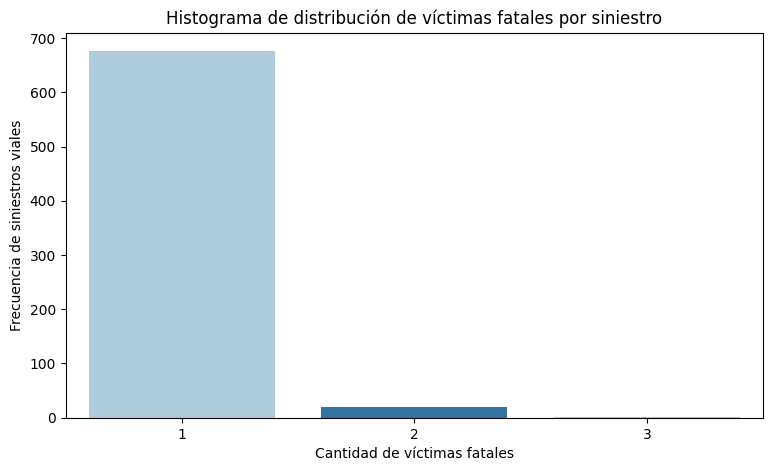
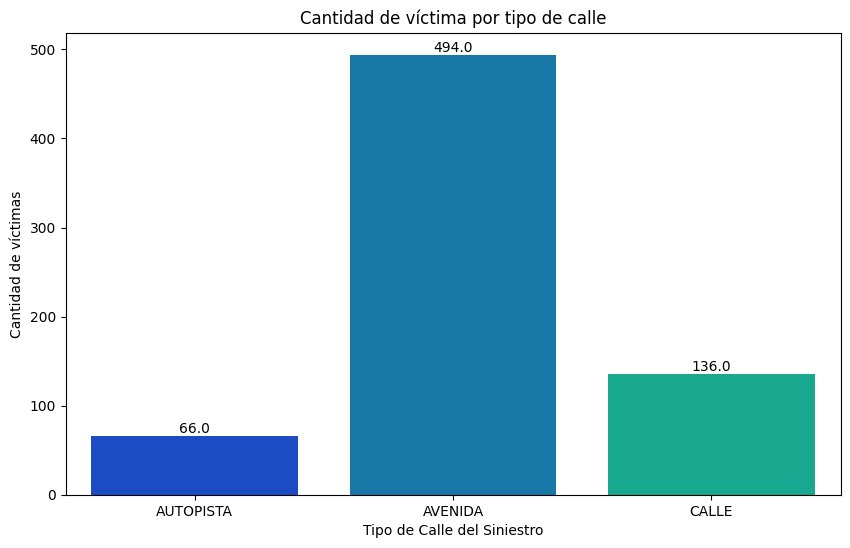
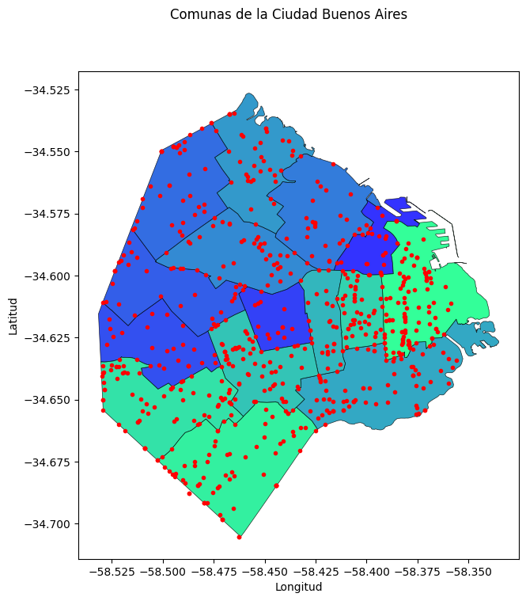
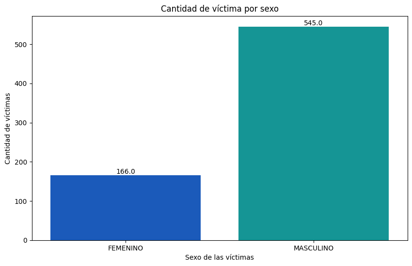

<h1 align="center"> Proyecto Individual 2 </h1>

<h1 align="center"> Análisis de Datos de Siniestros Viales en la Ciudad de Buenos Aires </h1>

¡Bienvenido al proyecto de análisis de datos de siniestros viales en la ciudad de Buenos Aires! 
Este proyecto tiene el objetivo de descubrir insights y proponer sugerencias para su mitigación.

## Problemática
Buenos Aires, al igual que muchas capitales del mundo, enfrenta una gran problemática de siniestros viales. Estos siniestros son una prioridad para las autoridades, quienes han tomado diversas medidas para su reducción. Una de estas medidas ha sido el registro de datos generados por los siniestros, lo cual brinda la oportunidad de analizarlos y obtener hallazgos significativos.

## Estructura del Repositorio 

-   **Archivos xlsx**: Son los archivos donde estan en el archivo los dataset reducidos para hacer las transformaciones de los datos.

-   **.gitignore**: Archivo que especifica los archivos y directorios que deben ser ignorados por Git.

-   **ETL.ipynb**: Archivo en donde ser hace la carga de datos y algunas transformaciones.

-   **EDA.ipynb**: Archivo Jupyter Notebook que contiene el análisis exploratorio de datos.

## Desarrollo del Proyecto

Durante el desarrollo del proyecto, se han generado los siguientes archivos:

1. **Datasets**: Se dispone de 1 archivo .xlsx para su análisis en el proyecto. Este archivos incluye información sobre homicidios y victimas de homicidios. Estos datasets han sido procesados mediante un proceso ETL (Extract, Transform, Load) y serán utilizados en el EDA (Exploratory Data Analysis) y en Power BI.

2. **ETL**: En este archivo en Python, se han realizado transformaciones y limpieza de los datos para que sean más manejables durante el análisis. Para visualizarlo más a detalle, ingresar a este [enlace](https://github.com/RafaelFAPROGRA/PI_DA_I/blob/main/1.%20ETL.ipynb).
Algunas de las acciones realizadas incluyen:

- Eliminación de columnas redundantes, como año, mes y día.
- Limpieza de datos en columnas con valores diferentes, como "SD", ".", etc.
- Cambio de tipos de datos para facilitar su manipulación.
- Renombrar columnas para que tengan nombres homogéneos entre los archivos.
- Agregar una columna de rango etario en lugar de la columna de edad.
- Reemplazo de valores faltantes y atípicos con NaN.
- Finalizando con dos archivos .xlsx para utilizarlo como Datasets para usarlo en el EDA y Power BI.

  

3. **EDA**: Se han realizado visualizaciones y tablas para explorar los datos en detalle. Algunas de las acciones realizadas incluyen:

  
- Análisis de datos de víctimas para entender sus características.
- Análisis de Outliers
- Relaciones de variables numéricas
- Relaciones de variables categóricas

  Dentro del análsis podemos visualizar los siguientes gráficos:

   
     

   - Se puede observar que el mayor número de víctimas fatales son menores a 42 años. Igualmente este resultado se podrá corroborar cuando se grafique por el rango etario.

   
     

   - El mayor número de sucesos se realizaron principalmente en las _'Avenidas'_ con un total de 494.

   
     

   - En esta gráfica, vemos el mapa de Buenos Aires separadas por las comunas que presentan, también los puntos rojos representan los siniestros viales suscitados, donde hay una mayor concentración en la comuna 1 y la 4.

   
     

   - Podemos visualizar que en mayor medida, son los _'hombres'_, los que sufrieron de siniestros viales y que causaron su fallecimiento. Para visualizarlo más a detalle, ingresar a este [enlace](https://github.com/RafaelFAPROGRA/PI_DA_I/blob/main/2.%20EDA.ipynb)

4. **Dashboard en Power BI**:
  El dashboard en Power BI consta de varias páginas que muestran información relevante sobre los siniestros viales y las víctimas. Veamos en detalle cada una de estas páginas:
  
  - Página de Hechos: Esta página muestra cómo ocurren los siniestros viales. Aquí se puede identificar la comuna donde son más frecuentes los siniestros, los años, meses y horas en los que ocurren con mayor frecuencia. Esta información es especialmente útil para que el gobierno de Buenos Aires pueda implementar medidas preventivas y correctivas para reducir el número de siniestros.
  
  - Página de Víctimas: En esta página se muestra el perfil de las víctimas. Conocer el perfil de las víctimas ayuda a enfocar los esfuerzos para reducir la cantidad de víctimas y siniestros.
  
  - Página de KPI: En esta página se presentan los KPI que permiten evaluar las acciones tomadas por el gobierno para disminuir los siniestros y la cantidad de víctimas. 
      
      **Reducir en un 10% la tasa de homicidios en siniestros viales de los últimos seis meses, en CABA, en comparación con la tasa de homicidios en siniestros viales del semestre anterior.**
      - En este caso, en el último semestre, la tasa de homicios fue de 1.364, representando una disminución del 30.952% al semestre anterior, cumpliendo ahi el KPI mostrado.

      **Reducir en un 7% la cantidad de accidentes mortales de motociclistas en el último año, en CABA, respecto al año anterior.**
      - En este caso, en el año 2021 hubo 46 victimas fatales relacionado a accidentes en moto, comparado al año anterior que hubo 29, logra un aumento del 58.62%, con lo que no cumpliría con el KPI, agregar también que podemos justificar ya que en el 2020 fue el año del inicio de la pandemia por lo que los casos en ese año disminuyeron considerablemente.

     
     

  El [dashboard](https://github.com/RafaelFAPROGRA/PI_DA_I/blob/main/PI_DA_I_Dashboard.pbix) en Power BI brinda una visión clara y concisa de la problemática de los siniestros viales y permite tomar acciones basadas en datos para reducir su incidencia y proteger a las víctimas.

## Autor ✒️
* **Yorschuat Rafael Farfan Acuña** 
